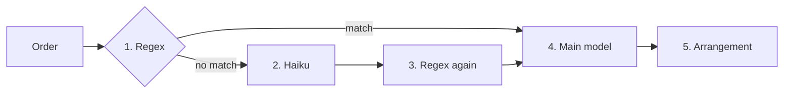

# RimworldVerbalCommands
### LLM-Assisted rimworld mod where users speak to an agent to set groups for different colony functions (e.g. pawn group by weapon they're holding, work priority based on skills, allowed zone based on pawn) and more.

Currently being tested with Anthropic models (claude-haiku-4-5, claude-sonnet-5, claude-opus-5, claude-opus-5-5). 

## Router (V2)



1. **Regex** looks at keyword matches first. If a keyword combination is found in the sentence, step 2 is skipped and the order goes to step 4.
2. **Haiku** looks at the user prompt, then replaces the player's words with something that is regexable.
3. **Haiku's output** goes into the tooling (into the user message) and makes the appropriate call based on what's found on regex table.
4. **The actual model** the player selected in settings goes in and makes appropriate output which writes to game.
5. **The actual model** makes the arrangement, and if you have your options selected for **Show parsed intent and ask before applying**, then it will show what it wants to do.

Both calls go through the same backend: the Anthropic API if you set an API key, or `claude -p` if you use the Claude Code CLI. The two are never mixed.

Older router did not use haiku for regex routing and went straight from user intent (prompt) to model. this caused too many tokens being used since model has to load tooling/data for everything.


### Changing the router model

If you'd like to tweak around and see which model does initial routing best, you can put your own router model in `router_model.txt`:

```
%USERPROFILE%\AppData\LocalLow\Ludeon Studios\RimWorld by Ludeon Studios\VerbalCommands\router_model.txt
```

If the model name in that file doesn't work, the mod uses `claude-haiku-4-5` instead and says so in the order window.


Test condition: 1 colony worth of 11 pawns (275x275 map), 1 colony (2 map) of 33 pawns (300x300) and 11 pawns (SOS2 space map, no odyssey), 1 colony of 325x325 map (57 pawns, 33 pawns).

## Current testing done: 
Weapon groups, work priority based on skill. 

## Tests needing to be done:

zoning based on pawn stats (so they dont waste time wandering around outside their jobsites), and eval metrics.
Verbal command itself (Currently all of the test was done with text input for fewer variability) based on Voice-to-text models. reasonablye promises.
Wishlist: Getting claude-haiku-4-5 to write changes properly. currently, haiku doesnt seem to make full changes and seem to accomplish tasks partially. a rule-based agentic process (sonnet + haiku), or multiple haikus (or 1 haiku with macro based rules) would be needed to keep API costs down.

Users are welcome to fork mod as needed and test with different models/add feature as necessary.
