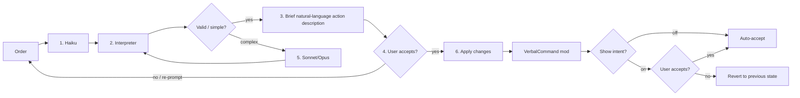

# RimworldVerbalCommands
### LLM-Assisted rimworld mod where users speak to an agent to set groups for different colony functions (e.g. pawn group by weapon they're holding, work priority based on skills, allowed zone based on pawn) and more.

Currently being tested with Anthropic models (claude-haiku-4-5, claude-sonnet-5, claude-opus-5, claude-opus-5-5). 

## Router (V2)


1. **Haiku** looks at the user prompt, then replaces the player's words with something that interpreter can accept.
2. **Haiku's output** goes into the interpreter to see if the prompt is actually valid.
3. Interpreter's actions are described in natural language (without using an LLM) and shown to user in brief. It is likely to be somewhat vague.
4. User can then accept actions as-is, or re-prompt. Complex orders (e.g. setting storage with filters, placing buildings, and combintions of simple tasks) gets routed to sonnet/opus
5. Sonnet/Opus dictates complex queries into interpreter, and the interpreter makes appropriate change by interacting with VerbalCommand mod. (this might not even be necessary)
6. Changes are then auto accepted if show intent option is off, or users can deny changes. if denied, then the game reverts to previous state.

Result: Significant token saving (if it works well enough, that is) since LLMs don't have to write bill changes by themselves, since the interpreter is the one manipulating game state. 

Since the interpreter accepts natural language (e.g. "build shelves that only accept food item into my freezer room"), that's all models need to type in.

End goal is to have easily typable language that is natural enough so people can simply verbally speak without having to use an LLM at all, and also an interpreter/harness so one day LLMs could play rimworld by reading game states and verbally typing (and receiving game state) from/to interpreter.


Both calls go through the same backend: the Anthropic API if you set an API key, or `claude -p` if you use the Claude Code CLI. The two are never mixed.

Older router did not use haiku for regex routing and went straight from user intent (prompt) to model. this caused too many tokens being used since model has to load tooling/data for everything. This albeit brute-force approach led to token waste and LLMs sometimes (model dependent) did not have enough attention to make all of the changes. Many tables were flipped as of result.


### Changing the router model

If you'd like to tweak around and see which model does initial routing best, you can put your own router model in `router_model.txt`:

```
%USERPROFILE%\AppData\LocalLow\Ludeon Studios\RimWorld by Ludeon Studios\VerbalCommands\router_model.txt
```

If the model name in that file doesn't work, the mod uses `claude-haiku-4-5` instead and says so in the order window.

### Main model and fallback model

Mod settings have two model fields. **Main model** is the router above (it reads every order first and turns it into short sentences; the field edits `router_model.txt`). **Fallback model** is used:

- when the main model's call fails (error, timeout, refusal, cut-off or empty answer): the same prompt goes once to the fallback model, and the order window says so;
- when the order window's "If the main model can't do it, try the fallback model" box is ticked and an order comes back as "cannot" or "not done": the order goes through the router once more with the fallback model in place of the main model. Orders sent as raw sentences call no model, so they are never sent again;
- for the whole order when the sentence router is turned off (the older path).

If both fields name the same model, the fallback is not asked.

### Other providers (.env)

Each of the two models can use its own provider, key and server, set in (next to `router_model.txt`):

```
%USERPROFILE%\AppData\LocalLow\Ludeon Studios\RimWorld by Ludeon Studios\VerbalCommands\.env
```

The mod makes this file on the first order with every line commented out, so nothing changes until a line is uncommented. Keys: `MAIN_PROVIDER`, `MAIN_MODEL`, `MAIN_API_KEY`, `MAIN_BASE_URL`, and the same with `FALLBACK_`. Providers: `anthropic`, `openai` (any server that speaks the OpenAI chat completions format), `claude_cli`, or the presets `ollama`, `lmstudio`, `openrouter`, `gemini`. A key left empty falls back to mod settings; the Anthropic key in mod settings is never sent to another provider. A line in `.env` wins over the matching field in mod settings.

## Mod settings

The settings page only names each setting. What they do:

- **Use Claude Code CLI instead of an API key**: no key needed; uses your Claude Code login.
- **Path to claude.exe**: blank = auto-detect (PATH, then `%USERPROFILE%\.local\bin\claude.exe`).
- **Main model / Fallback model**: see "Main model and fallback model" above. A line in `.env` wins over these fields.
- **Fallback model**: used when main model's call fails. [cannot] gate bypasses are found on verbal command chatbox ingame.
- **Effort**: low/medium/high/xhigh/max. Not sent to non-Anthropic providers.
- **Use the sentence router**: orders become short sentences the mod checks and carries out. On: your order is turned into short sentences by a small model, the mod checks each one and shows you what it will do. If the order is unclear, it asks you a question first and changes nothing. Off: the older way, where the main model plans the whole order.
- **Save router log**: what was sent to Haiku, replies, and what was done.
- **Agent inbox: run orders from text files in the inbox folder**: off by default. When on, each .txt file put in `%USERPROFILE%\AppData\LocalLow\Ludeon Studios\RimWorld by Ludeon Studios\VerbalCommands\inbox` is run as an order (oldest first) and its result is written to the outbox folder next to it. Only that folder is read; nothing listens on the network. The router log is always written while this is on.
- **Save sent orders to transcripts.jsonl**: for checking voice accuracy.
- **Collect voice debug data**: Turn this on if you're having transcription issues. Saves debug data you can attach to a bug report.


Test condition: 1 colony worth of 11 pawns (275x275 map), 1 colony (2 map) of 33 pawns (300x300) and 11 pawns (SOS2 space map, no odyssey), 1 colony of 325x325 map (57 pawns, 33 pawns).

## Current testing done: 
Weapon groups, Work priority, Item/gear query, rudimentary blueprint/plan placement (still needs to be worked on), storage settings, draft/move pawn.

## Tests needing to be done:

zoning based on pawn stats (so they dont waste time wandering around outside their jobsites), and eval metrics.
Verbal command itself (Currently all of the test was done with text input for fewer variability) based on Voice-to-text models. reasonable promises.

Users are welcome to fork mod as needed and test with different models/add feature as necessary.
